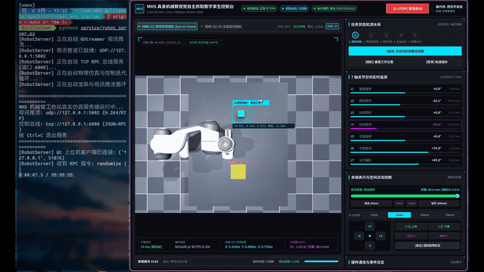
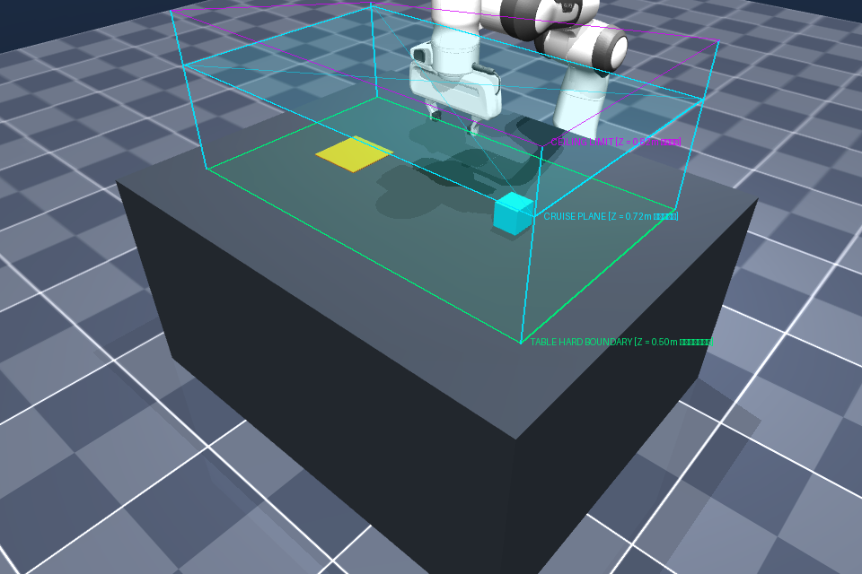

# 具身智能机械臂视觉自主抓取与数字孪生工作站 (Robot Arm Manipulation Station)

本项目为一个独立的工业级具身智能与机器人操作平台，实现机械臂基于 3D 视觉感知将目标工件从初始位姿（A 点）自主识别、门字形避障抓取并平稳搬运至目标托盘（B 点）的完整控制闭环。



---

## 1. 系统架构与工程目录

本项目严格遵循工业级高内聚、低耦合的模块化分层设计：

```text
robot_arm_station/
├── requirements.txt           # Python 核心依赖清单与环境配置指南
│
├── simulation/                # 物理仿真底座 (基于 MuJoCo 真实物理与动力学资产)
│   ├── franka_emika_panda/    # Franka Emika Panda 7自由度机械臂与平行夹爪资产
│   └── universal_robots_ur5e/ # Universal Robots UR5e 六轴协同机器人资产
│
├── kinematics/                # 机械臂运动学与动力学算法核心库
│   ├── __init__.py            # 模块导出定义
│   ├── ik_solver.py           # 6-DOF 阻尼最小二乘 (DLS) 逆运动学求解器
│   └── trajectory.py          # 门字形高空避障轨迹规划器与 S 曲线平滑插补器
│
├── perception/                # 机器视觉感知与手眼标定模块
│   ├── __init__.py            # 模块导出定义
│   ├── block_detector.py      # 工件特征识别、小孔逆投影与手眼标定 3D 位姿定位器
│   └── test_receiver.py       # 独立视频拉流与解码验证测试工具
│
├── service/                   # 机器人系统调度与通信总线主控服务
│   └── robot_server.py        # 统一后端：物理引擎运行、双机位推流、RPC 总线与 FSM 调度
│
└── qt_client/                 # 工业数字孪生客户端工程 (C++ / Qt 6 QML)
    └── robot_console/         # 基于 Qt 6 构建的 Cyber-Physical 赛博朋克工业级控制台
```

---

## 2. 快速开始与环境安装

### 步骤一：创建独立 Python 虚拟环境并安装依赖
推荐使用 Python 原生 `venv` 确保运行环境隔离：

```bash
# 1. 创建并激活独立虚拟环境
python3 -m venv venv
source venv/bin/activate

# 2. 安装 Python 核心依赖清单
pip install -r requirements.txt
```

### 步骤二：安装系统级 GStreamer 视讯多媒体库 (Linux 环境)
工作站采用 GStreamer RTP H.264 UDP 硬件/软件编码推流，请确保宿主机已安装核心插件：

```bash
sudo apt update && sudo apt install -y \
    gstreamer1.0-tools \
    gstreamer1.0-plugins-base \
    gstreamer1.0-plugins-good \
    gstreamer1.0-plugins-bad \
    gstreamer1.0-plugins-ugly \
    gstreamer1.0-libav
```

### 步骤三：编译数字孪生控制台 (Qt 6 Client)
控制台支持通过标准 CMake 在命令行直接构建，亦可使用 Qt Creator 打开 `CMakeLists.txt` 构建运行：

```bash
# 安装 Qt 6 与 CMake 编译构建工具链 (如系统未安装)
sudo apt install -y build-essential cmake qt6-base-dev qt6-declarative-dev libgstreamer1.0-dev libgstreamer-plugins-base1.0-dev

# 编译客户端
cmake -B qt_client/robot_console/build -S qt_client/robot_console -DCMAKE_BUILD_TYPE=Release
cmake --build qt_client/robot_console/build -j$(nproc)
```

---

## 3. 工作站运行指南

### 1. 启动统一核心服务 (Robot Server)
统一主控服务负责拉起 MuJoCo 物理引擎、开启多机位 GStreamer 视频推流（UDP:5002），并监听 TCP:6000 RPC 控制总线：

```bash
python service/robot_server.py
```
> 说明：早期的 `camera_streamer.py` 仅为独立视讯测试脚本，现已全面废弃并合入 `robot_server.py`。统一运行 `robot_server.py` 即可完成物理仿真与视频推流。

### 2. 启动数字孪生上位机控制台 (Qt 6 Client)
在另一个终端中启动编译就绪的上位机界面（或直接在 Qt Creator 中点击运行）：

```bash
./qt_client/robot_console/build/approbot_console
```
上位机启动后将自动建立双向遥测信道，并在左侧视口秒级挂载低延迟推流画面。

---

## 4. 核心工作流与技术实现

整个自主搬运任务由高可靠性有限状态机（FSM）驱动，包含以下 5 个关键阶段：

1. **视觉感知与位姿解算 (Vision Acquisition)**:
   - 顶部俯视相机（`overhead_cam`）捕获图像，由 [`BlockDetector`](perception/block_detector.py) 提取工件亚像素中心，基于小孔逆投影模型与手眼外参，毫米级输出工件在机械臂基坐标系下的三维物理坐标 $(X, Y, Z)$；
2. **预抓取逼近 (Approach)**:
   - 由 [`TrajectoryPlanner`](kinematics/trajectory.py) 规划门字形高空安全巡航航路点（$Z = 0.720\text{ m}$），机械臂高空对齐工件正上方后，沿负 Z 轴严格直线垂直下潜至抓取深度（$Z = 0.584\text{ m}$），杜绝任何水平撞击；
3. **闭环抓取 (Grasp)**:
   - 夹爪以高刚度闭合咬合工件，依靠真实物理刚体摩擦产生牢固抓持力；
4. **提升与高空运送 (Lift & Transit)**:
   - 工件夹紧后垂直拔升至高空巡航高度，水平跨越平移至目标托盘区 B 正上方；
5. **精准放置与安全归位 (Place & Home)**:
   - 平稳下潜至托盘表面（$Z = 0.588\text{ m}$），夹爪张开脱附工件；随后机械臂垂直拔升回高空安全巡航平面，并水平返回悬空就绪待机位 $q_{home}$，**距离桌面全程维持 $>15\text{ cm}$ 安全净空，彻底消除向下触碰工作台的现象**。

---

## 5. MHS 3D 电子安全包络 (Safety Geofence)

工作站在相机 02（3D 全局透视监控）模式下内置了基于物理防碰撞约束的 **3D 虚拟安全栅栏（Electronic Safety Geofence）**：



- **底面硬边界 ($Z = 0.500\text{ m}$)**：高亮绿色实体线框，严格贴合工作台表面，作为物理防砸防穿透的不可突破底限；
- **避障巡航层 ($Z = 0.720\text{ m}$)**：亮青色线框与对准线，作为门字形避障路径的高空水平平移层；
- **空间顶盖 ($Z = 0.820\text{ m}$)**：品红色虚线顶盖与四根立体防护立柱，界定机械臂作业安全立体笼；
- **交互开关**：上位机视讯工具条与监控浮动条提供一键切换按钮，支持根据工况随时开启或隐藏 3D 虚拟栅栏显示。
